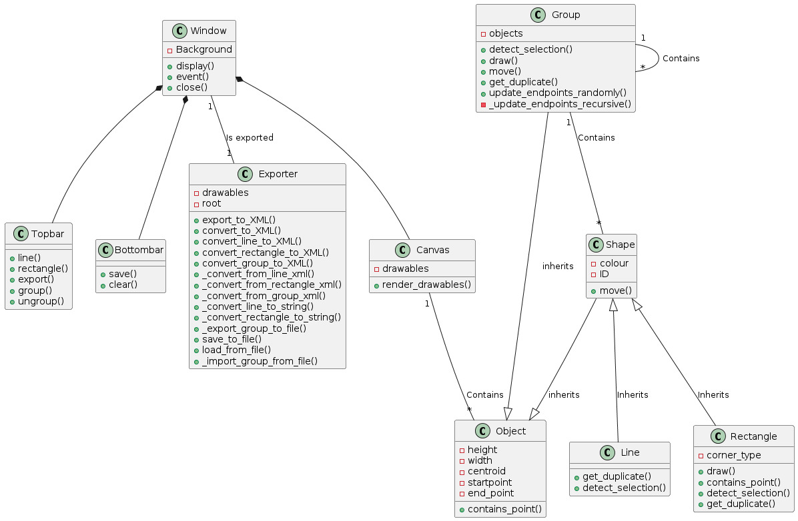
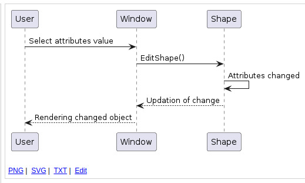
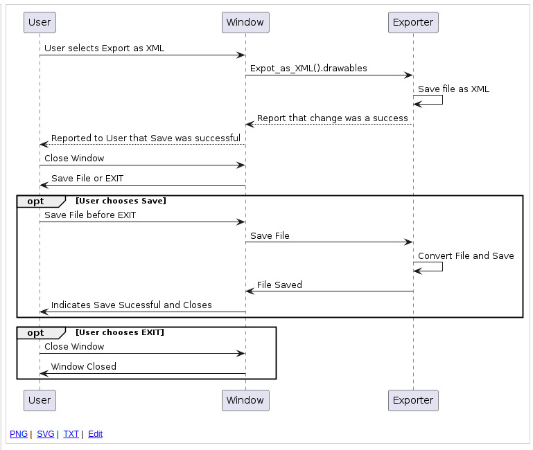

# HARPP - Drawing Application

This project is a drawing application that allows users to create, manipulate, and save drawings consisting of various object types such as lines, polylines, curves, rectangles, ellipses, text, and images. It provides a user-friendly interface for drawing and editing objects, as well as grouping and ungrouping them. Additionally, the application supports saving and loading drawings from files and exporting to XML format.
## Team Members

This project was built by the team of five members:

- Harpreet Singh - 2022101048 [H]
- Atidipt Ashnin - 2022111010 [A]
- Raveesh Vyas   - 2022114002 [R]
- Prakhar Jain   - 2022115006 [P]
- Prakhar Singhal- 2022111025 [P]
***
## Features

- **Drawing Object Types**: The application supports an indefinite number of drawing object types, including lines, polylines, rectangles. Users can select an object type from a menu or toolbar and draw it using the mouse.

- **Manipulating Objects**: Users can manipulate objects in the drawing by selecting them with the mouse. Once selected, objects can be deleted, copied, moved, or edited.

- **Editing Objects**: Objects can be edited by displaying a dialog box with properties specific to the object type. For lines, only the color property is editable, while for rectangles, both line color and corner style (square or rounded) can be modified.

- **Grouping Objects**: Objects can be grouped into larger units, allowing operations such as deletion, copying, and moving to be applied to the entire group. Groups can be nested, and ungrouping can remove one or all layers of grouping.

- **Saving and Restoring Drawings**: Drawings can be saved to and loaded from ASCII text(.txt) files. The file format includes information about object types, coordinates, colors and style.

- **Exporting**: Drawings can be exported to any format, Curently XML format is supported, which is useful for integration with other applications.

## Requirements Implementation

All functional requirements specified in the project description have been implemented successfully. The design accommodates the mentioned drawing object types, object manipulation operations, editing capabilities, grouping and ungrouping functionality, saving and loading drawings from files, and exporting to XML format.

## Getting Started
<small>Note: requires [python3.10](https://www.python.org/downloads/) or above</small>

To get started with the application, follow these steps:

1. Navigate to the project directory: `cd HARPP`
2. Set up a Python virtual environment:
   - Using `python3 -m venv env`
   - Activate the virtual environment: `source env/bin/activate`
3. Download requirements: `pip install -r requirements.txt`
4. Run the application: `python3 src/main.py`
***
## User's Guide

**Drawing**:
- Click any drawing option from `Line` and `Rectangle` on the navbar.
- Click on two points on the screen. A line will be formed joining those two points if the `Line` option is selected. If the `Rectangle` option is selected, a rectangle will be drawn with the line joining those two points as the diagonal.

**Group**:
- Click the `Group` button on the navbar.
- Start clicking on the objects or groups you wish to group. They will be highlighted in yellow.
- If you wish to drop the current selection, press the object again, it will return to original color.
- After you are done selecting, press the `Done` button, and the objects will be grouped.

**Ungroup**:
- Click the `Ungroup` button on the navbar.
- Choose a group you wish to ungroup. It will be automatically decomposed into the subgroups it was initially made up of.

**Export XML**:
- After you are done drawing, press the `Export to XML` button on the navbar.
- You will be prompted to name your `.xml` file. Click `Ok` when done.

**Save**:
- After you are done drawing, press the `Save` button on the toolbar.
- Enter a name with a `.txt` extension and press `Ok`.

**Open**:
- To open a new drawing from an ASCII file (`.txt`), press the `Open` button on the toolbar.
- Choose your desired `.txt` file and click `Open`.
- Note: If you have an unsaved project open, make sure to save it before opening a new file, or you will lose your data. If you have already saved it, click `No` when prompted again.

**Clear**:
- Clear the canvas by pressing the `Clear` button on the toolbar.## Design and architecture

**Edit**:
- Right-click on a drawn shape, and you will be prompted with four options: Edit, Delete, Copy Paste, and Cancel.
- The `Edit` option pops up a dialog with editable fields for the object.
- The `Delete` option removes the selected group or object from the canvas.
- The `Copy Paste` option copies the currently selected object, allowing you to paste it at a desired location using the cursor.
- The `Cancel` option takes you back to the previous window.

<small> Note: The Editor inherently implements a layering system, where the last drawn object is always on top of the previous ones and hence is priorit boosted in operations </small>

## Design patterns used

**Composite**:
- Enables treating individual objects and compositions of objects uniformly. In our case, it allows us to group and ungroup shapes and objects seamlessly, enhancing the flexibility of our drawing functionality.

**Adapter**: 
- Allows incompatible interfaces to work together. We use it to export our drawing by adapting the export class's interface to fit our drawing structure, ensuring a smooth export process without modifying the existing drawing logic.

**Singleton**:
- Ensures a class has only one instance and provides a global point of access to it. In our application, the window being a singleton guarantees there can't be multiple instances of it, maintaining consistency and control over the window management.

### UML Class Diagram: 

### UML Sequence Diagrams:

We have tried our best to keep our code free from code smells and provided detailed method and class docstrings for easy understanding.

# TO DOs:
- fix group bug @raveeshvyas
- implement import from xml and add pen_width to xml file. @Harpreet287
